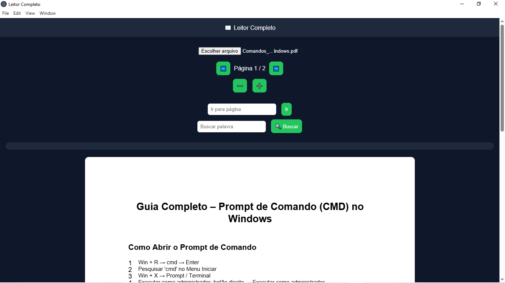

# 📖 Leitor Inteligente

Aplicativo desktop desenvolvido com **Electron** para leitura e análise de arquivos.

## 🚀 Funcionalidades

✅ Suporte a múltiplos arquivos:
- 📄 PDF  
- 📝 Word (.docx)  
- 📃 TXT  
- 📊 Excel (.xlsx)  

✅ Navegação:
- ⬅️ Avançar e voltar páginas  
- 🔍 Zoom  

✅ Busca inteligente:
- 🔎 Buscar palavras, frases e números  
- 📊 Contar ocorrências  
- 📍 Mostrar em quais páginas aparece  
- ✅ Clique → ir direto para o conteúdo  

✅ Visualização:
- 📖 PDF estilo leitor (tipo Kindle)  
- 📊 Excel exibido como tabela organizada  
- 📝 Texto com destaque automático  

---

## 🖥️ Tecnologias utilizadas

- Electron  
- JavaScript  
- HTML + CSS  
- PDF.js  
- Mammoth.js (Word)  
- XLSX.js (Excel)  

---

## 📦 Instalação

### 🔹 Opção 1 — Executável

Baixe o instalador na seção **Releases** do projeto.

---

### 🔹 Opção 2 — Rodar manualmente
bash --
1°-npm install
2°-npm start

## 📸 Preview

